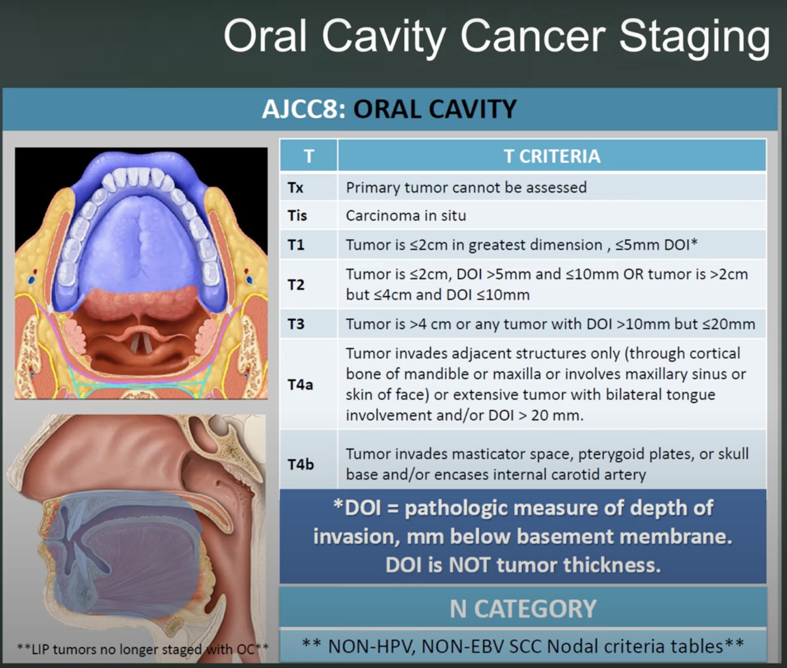

# Head & Neck Cancer Staging

## Oral Cavity

### T-Stage

### N-Stage

- **NX:** nodes cannot be assessed
- **N0:** no regional node metastases
- **N1:** metastasis in single ipsilateral node, ≤3 cm, and no extranodal extension (ENE(−))
- **N2**
  - **N2a:** metastasis in single ipsilateral node, >3 cm and ≤6 cm, and ENE(−)
  - **N2b:** metastasis in multiple ipsilateral nodes, all ≤6 cm, and ENE(−)
  - **N2c:** metastasis in bilateral or contralateral nodes, all ≤6 cm, and ENE(−)
- **N3**
  - **N3a:** metastasis in a node, >6 cm, and ENE(−)
  - **N3b:** metastasis in a node with clinically overt ENE(+) (ENEc)
